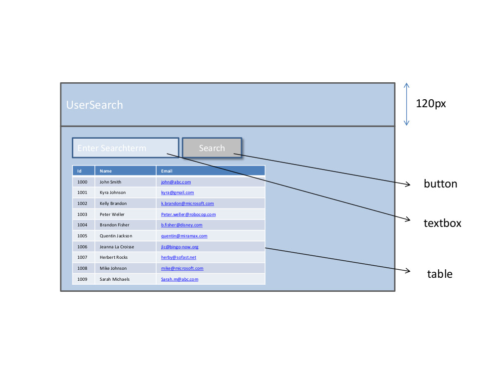
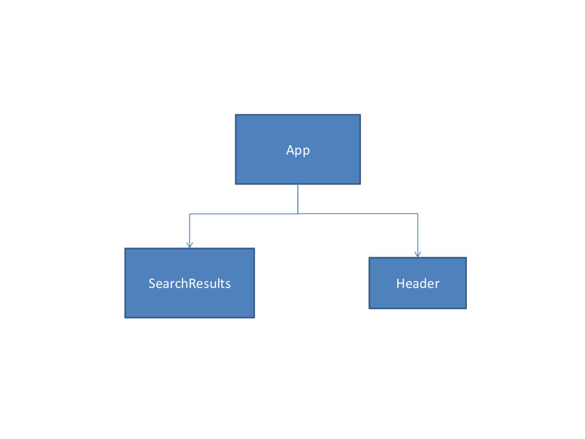
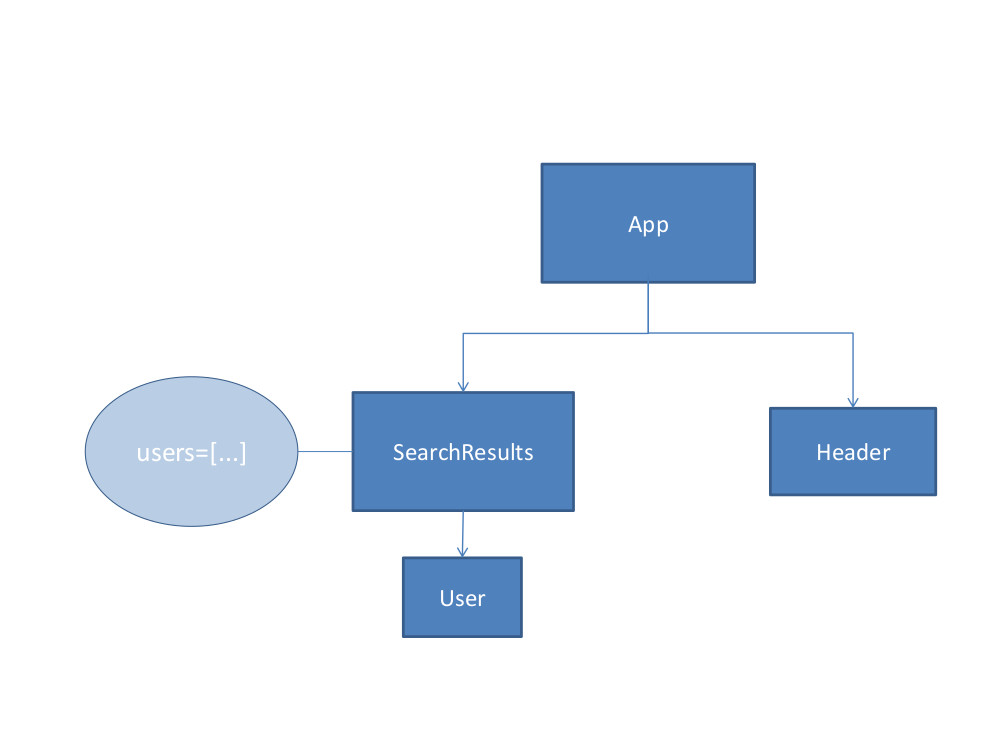
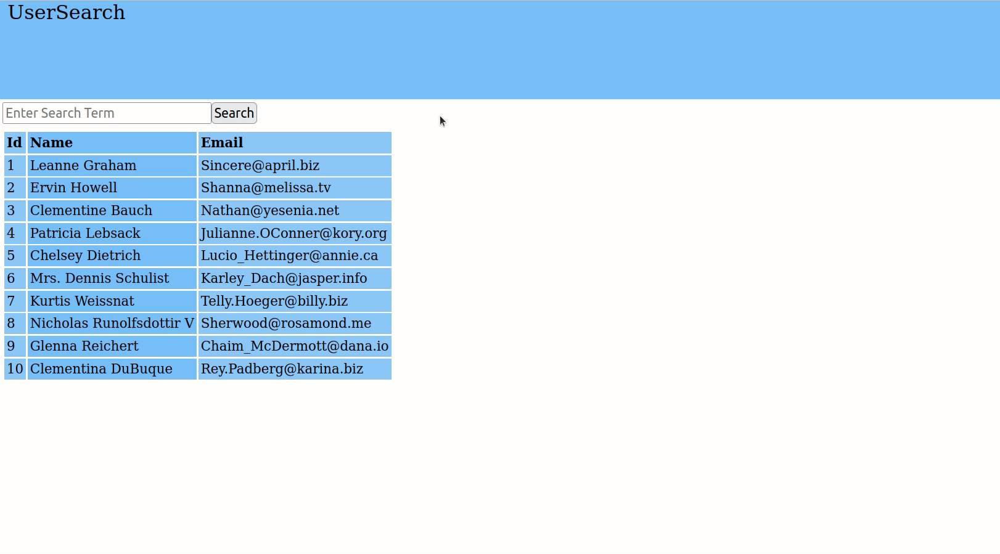

# React Practice with useEffect hooks

Let's create an app from scratch to practice using the **`useEffect()`** hook.

You should try to complete tasks 1-3 below. This is the minimum amount of this exercise you should aim to complete.

**If you have extra time**, you can also try to complete tasks 4-5, which provide a more "realistic" example of using the `useEffect()` hook.

---

## Task 1: Layout

1. This will be the layout for your app. Study it, and then go on to Task 2!

---

## Task 2: Component Structure

1. Create a functional "Header" component. This will render the "header" part of your layout.
2. Create a functional "SearchResults" component. This will render the search input from the above image, but not the table of results (that will come later!).

---

## Task 3: Using a simple useEffect hook

1. Add a `useEffect` hook in the "App" component.
2. This hook should only execute **once**, when the app first loads. It should not be printed again, even if the app updates later on.
3. When the hook executes, it should show the user an `alert` with the message "Welcome to the App!"

---

## ----- Well done if you have got this far with everything working! -----

If you have more time, please continue with Tasks 4 and 5. 

They will be very helpful for you to practice building an app using React, but you do not **need** to finish both of them. Just get as far as you can in the time available. :-)

---

## Task 4: Adding State & User component

1. In the **`SearchResults`** component, use a `useState` hook to create a state variable called `users`. This should be initialized to an empty array. 
2. In the **`SearchResults`** component, use a `useEffect` hook to make a `fetch` request **only** when the component first renders. The `fetch` request should be made to the fake "users" API we looked at before ([jsonplaceholder API link](https://jsonplaceholder.typicode.com/users)). When the fetch request is complete, you should use the data received from the API to update your "users" state variable to contain all the received data.
3. In the **`src`** directory, create a functional **`User`** component, which will be a child of the `SearchResults` component. Each instance of the **`User`** component should receive three props from its parent: `id`, `name` and `email`. These will be the "id", "name" and "email" of **one** of the users in your state.
4.  Each instance of the `User` component should return JSX of one table row (`tr`) element. This element should also contain **three** table-cells (`td`) - one for each of the props.
5. Finally, make sure the **`SearchResult`** component renders a table. Inside the table, you should **map** your state variable `users` and render a `User` component for each user you find.

---

## Task 5: Adding Search Function

**This is a bonus for anyone who finishes early. Do not worry if you don't get this far!**

See if you can use everything you have learned so far to achieve the below functionality! 

You should be able to type a search term into the `input` and, on clicking the button, find all users whose name **or** email contains the search term as a substring.

### Demo of Task 5 functionality:

